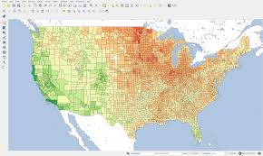

### Appendix: P1: Report Outline
**What Sparks Joy: Examining the Factors Behind Global Happiness**  
Codename: Utopia  
Rahul Prasad, Welson Nguyen, Geo Cabatingan, Pow Areepipatkul

#### 1.0 Introduction  
##### 1.1 Problem Situation
Happiness scores and rankings are taken from Gallup World Poll, which ranks the state of global happiness between 2015 - 2017. These scores are based on answers to the questions asked on life evaluation polls. This dataset tries to represent the six factors: economic production, social support, life expectancy, freedom, absence of corruption, generosity - and how they contribute to the overall happiness of the country.
##### 1.2 What Is the Problem
We would like to see what factors matter most/least to a country’s overall happiness (magnitude-wise). Are there any trends based on the region the country belongs to, more specifically, is there a correlation between region and happiness score? Are certain regions more happy than other regions? How much do factors like economy and family play a role towards the happiness score? We will aim to address these questions and present any findings that stand out.

##### 1.3 Why Does it Matter
Happiness, by its very nature, is a subjective feeling. While this can make it hard to isolate what makes a particular individual happy, our hope is that by analyzing large trends across larger sample sizes, we will discover common factors that influence happiness. Understanding what makes us happy will allow us to make more conscious decisions to improve our future happiness and overall well-being.

##### 1.4 How Will it be Addressed
We will address the issue of happiness trends between different countries by assessing a multitude of common societal factors such as freedom, government trust, or GDP and analyzing how those factors correlate to overall happiness for respondents in their respective countries. As we can see in the yearly datasets, each country’s respondents place different impact on each happiness variable, and assessing them individually can help us determine what exactly makes these respondents happy.  

#### 2.0 Research Questions
**1.** What are the two most impactful features that contribute to a country’s happiness?

**2.** What are the current happiness score trends (increase/decrease in score) for each region between 2015 and 2017?

#### 3.0 Possible Data Sets
2017 World Happiness Report: A recording of observations that ranks 155 countries by their happiness levels. Released by the United Nations in 2017 to commemorate the International day of happiness. This reports country’s happiness on a scale from 0-10. With thousands of  observation grouped into into 155 unique country, this report describes 12 attributes.
https://www.kaggle.com/unsdsn/world-happiness?fbclid=IwAR1ihEwi1DqBwvlW7heKa5PKXYRmO_WScJjjnvdSQknybRf7_Zj6sKf2ZqI#2017.csv

2015 World Happiness Report: Similar to the 2017 World Happiness Report, 2015 World Happiness Report is a data set recorded within the year 2015. Reported by the United Nations, 2015 is the third report of the series of the World Happiness Report. With thousands of observation grouped into 158 unique countries, this report describes each 12 attributes.
https://www.kaggle.com/unsdsn/world-happiness?fbclid=IwAR1ihEwi1DqBwvlW7heKa5PKXYRmO_WScJjjnvdSQknybRf7_Zj6sKf2ZqI#2015.csv

#### 4.0 Information Visualizations
   
>*Figure 1* This graph shows the beauty of an area based on the Natural Amenities scale. We plan to use ours to show reported happiness in different countries around the globe.  

>*Figure 2* This scatterplot shows the relationship betweens participants' height and weight. We plan to use scatterplot(s) to depict the relationship between variables like life expectancy and freedom, and overall happiness.p

#### 5.0 Team Coordinations
**Meeting Time:** Tuesday 2:30 - 4:30PM, will be our usual meeting time for the week

**Individual Goals/Roles**  
**Pow:** I will take the responsibility of doing the technical tasks (specifically coding) and can lead the team if needed. My goal is to understand the main driving force behind the happiness scores of each country. I want to see if there are any correlations between certain regions and specific factors.

**Geo:** I will take responsibility of analyzing trends in the data and effectively work on the data visualization through mapping. My goal is to see what exactly goes behind attributing happiness to certain countries. I also hope to analyze if there are any other factors besides the main variables we see that affect overall happiness.

**Rahul:** I will take responsibility of working with Markdown to create vivid explanations of our data that allow the reader to better understand the data they are viewing, and the implications of it. My goal is to take our findings and explain to the reader why they matter, and how they can possibly improve their own quality of life.

**Welson:** I will be responsible with overall support through all platforms that will function mainly as a quality assurance. I hope to learn to communicate findings and practices, and to study patterns within the data when searching for happiness trends. Through either data analyst or group discussions, I aim to discover a new level of critical thinking.

**Group Goals/Guidelines:** Communication is mainly done through our Facebook messaging group, we will meet in-person every Tuesday after our INFO section time.
We strive to do our best to communicate directly and clearly with each other, while providing constructive feedback if needed as we work through each problem together. The breakdown of tasks will be done throughout each weekly meeting so that each member has an assigned role for which they are responsible for.

#### 6.0 Questions for Teaching Team

#### 7.0 References
**Link to Data Sets:**  
https://www.kaggle.com/unsdsn/world-happiness?fbclid=IwAR31xIt6p8pRTbJdSqanFS3FIwHYqwe0XN6QgBJj3Tp8_CKDDgxXMWGdFrI
